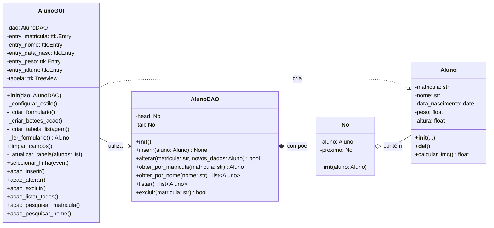

# Definição da Arquitetura e Stack do CRUD de Alunos

**Data:** 11 de Agosto de 2026  
**Status:** Aceito  
**Autores:** Equipe de Desenvolvimento Python  

## 1. Contexto (O Problema do mundo real)
Precisamos desenvolver uma aplicação Desktop para gerenciar o cadastro de Alunos (CRUD completo: Create, Read, Update, Delete). A aplicação deve ser construída estritamente sob o paradigma de Programação Orientada a Objetos (POO), garantindo a separação de responsabilidades (MVC: View, Controller/DAO, Model) e evitando o uso de bibliotecas externas (zero dependências) para facilitar a distribuição e a avaliação dos conceitos de base da computação.
Os alunos devem possuir os seguintes atributos: matrícula, nome, data de nascimento, peso e altura.

## 2. Opções Consideradas
* **Interface Gráfica:** Bibliotecas Desktop (PyQt, Tkinter).
* **Armazenamento:** Estruturas de Dados em Memória: Lista Encadeada Simples.
* **Paradigma:** Código Orientado a Objetos (arquitetura em camadas).

## 3. Decisão
Decidimos implementar uma **Arquitetura em Camadas (padrão MVC/DAO)** utilizando **Python puro (Standard Library)**. 

### 3.1. Fundamento do Modelo MVC
O MVC (Model-View-Controller) é um dos padrões de arquitetura de software mais populares e fundamentais no desenvolvimento de aplicações (sejam elas web, mobile ou desktop). O seu principal objetivo é separar as responsabilidades do código, dividindo o sistema em três camadas independentes, mas interconectadas.
Essa separação torna o código mais organizado, facilita a manutenção, permite que diferentes equipes (como designers e programadores) trabalhem no mesmo projeto simultaneamente e torna a aplicação muito mais fácil de testar e escalar.
* **A camada View (Visão):** É literalmente o que o usuário "vê" e com o que interage. Ela é a interface gráfica (UI) da aplicação, seja uma página HTML no navegador, uma tela de aplicativo de celular ou uma janela Desktop nativa (como no caso do Tkinter em Python).
* **A camada Controller (Controlador):** O Controller (Controlador) atua como o intermediário e o coordenador entre a View e o Model. Ele é o gerente de tráfego que recebe as requisições, interpreta a intenção do usuário e decide quem vai fazer o quê.
* **A camada Model (Modelo)** É o coração da sua aplicação. Ela é responsável por gerenciar os dados (persistência), a lógica de negócios e as regras intrínsecas do sistema.

### 3.2. O Padrão DAO (Data Access Object)

Para a arquitetura de persistência, a aplicação implementa o **Padrão DAO (Data Access Object)**. Trata-se de um padrão de projeto estrutural de software que tem como objetivo principal separar (abstrair) as regras de negócio e a interface de usuário da lógica de acesso a dados.

**Definição:**
O DAO atua como um intermediário entre a aplicação e a fonte de dados (seja ela um Banco de Dados Relacional, um arquivo TXT, uma API externa ou, como em nossa versão inicial, uma Lista Encadeada em memória). Ele encapsula todas as operações de CRUD (Create, Read, Update, Delete) em métodos públicos padronizados.

**Aplicação no Projeto:**
Em nossa aplicação, o padrão DAO é o que garante o cumprimento do princípio de **Inversão de Dependência (SOLID)**.
A classe da Interface Gráfica não sabe se os dados dos alunos estão sendo salvos em uma Lista Encadeada ou no SQLite; ela apenas conhece o "contrato" oferecido pelo DAO.

Essa abstração é o que nos permite migrar do armazenamento em memória para o banco de dados SQLite sem reescrever uma única linha de código da nossa interface gráfica ou da nossa classe de domínio.

### 3.3. As tecnologias e padrões definidos foram:
* **Linguagem Python:** Python é uma linguagem estritamente case-sensitive (sensível a maiúsculas e minúsculas).
* **Camada de Apresentação (View):** Módulo nativo `tkinter` (com `ttk` para temas e `Treeview` para a listagem). Arquivo: `gui.py`.
* **Camada de Domínio (Model):** Classe `Aluno` tipada estaticamente, fazendo uso de construtor (`__init__`) e destruidor (`__del__`) para gestão do ciclo de vida do objeto. Arquivo: `aluno.py`.
* **Camada de Acesso a Dados (DAO):** Implementação do padrão *Data Access Object* utilizando uma **Lista Encadeada Simples** criada do zero (classe `No`) para armazenamento dos dados em memória. Arquivo: `aluno_dao.py`.

## 4. Justificativa
Optamos por esta abordagem porque:
* **Zero Dependências:** Ao utilizar `tkinter`, `datetime` e estruturas de dados nativas, a aplicação não exige o uso do `pip` para instalar pacotes de terceiros, rodando em qualquer instalação padrão do Python.
* **Foco em POO e Estruturas de Dados:** A implementação de uma Lista Encadeada manual para o DAO permite total controle sobre a manipulação de ponteiros e alocação/liberação de memória em Python, alinhado com fortes requisitos acadêmicos e de engenharia de software.
* **Desacoplamento:** A separação em três arquivos garante que a Interface Gráfica não conheça a estrutura da Lista Encadeada, comunicando-se apenas através de contratos bem definidos (métodos do DAO), respeitando os princípios SOLID.

## 5. Consequências

### Positivas (Prós)
* Alta coesão e baixo acoplamento: é possível substituir a GUI por uma interface de terminal de forma isolada, sem alterar a regra de negócio.
* Aplicação extremamente leve e de execução instantânea.
* Código excelente para estudo aprofundado de ponteiros, referências e *Garbage Collection* no Python.

### Negativas (Contras / Trade-offs)
* **Volatilidade de Dados:** Como optamos por uma Lista Encadeada em memória, todos os dados são perdidos quando o programa é encerrado.
* **Complexidade de Busca:** Pesquisar alunos pelo nome ou matrícula em uma lista encadeada possui complexidade *O(N)*, o que significa que o tempo de busca cresce linearmente com a quantidade de cadastros (diferente da busca em tabelas hash/dicionários ou bancos indexados).

## 6. Diagrama de Classe da Aplicalçao

